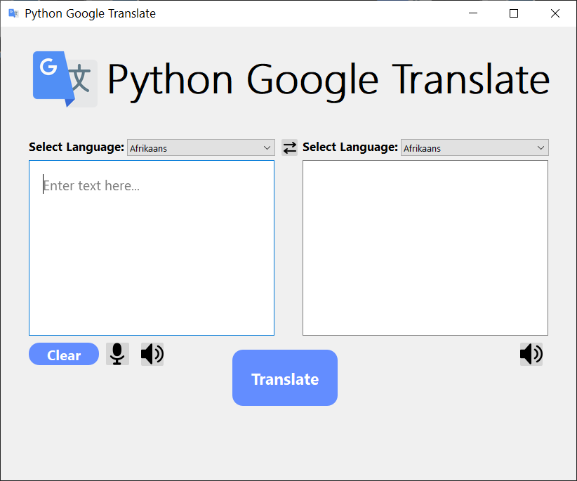

# Python Google Translate
This program uses Google text to speech and speech recognition libraries. The input is then translated using googletrans library. Users can listen to the input and output. Input can also be provided using the mic symbol.

<p align="center">
  
</p>


# Requirements
Python 3
requirements.txt file included.
Use:
```pip install -r requirements.txt ```  
    
[Go here and download the relevant PyAudio file for your python3 version](https://www.lfd.uci.edu/~gohlke/pythonlibs/#pyaudio)  

Example (Here python3.8): 
```pip install PyAudio-0.2.11-cp38-cp38-win32.whl```   
[Video Tutorial for PyAudio](https://www.youtube.com/watch?v=_wgOhzceMTw )  


# Files
requirements.txt - Includes the list of external libraries needed to run this program.  
gui.py - This contains the GUI made using PyQt5.  
translate.py - The main program file.  
gtranslate.pyw - Alternate main program file that runs without console in the background.  
Icons - audio.png, mic.png, swap.png, trans.ico  
P_G_T.PNG - GUI Main Window Screenshot. 
 
 
# Acknowledgements
[Youtube channel- "paradise _hope" for help with PyAudio installation error](https://www.youtube.com/watch?v=_wgOhzceMTw)

